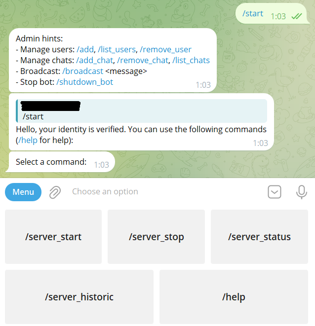
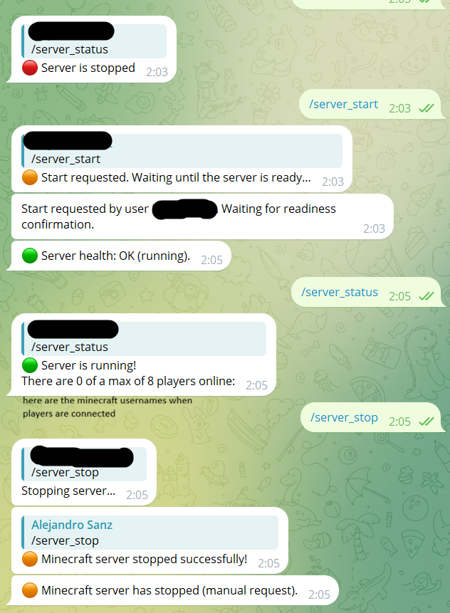
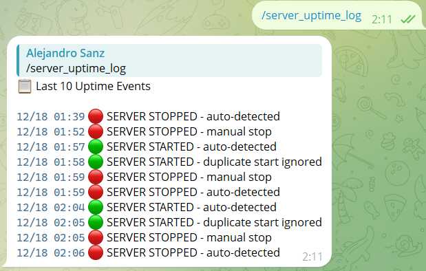
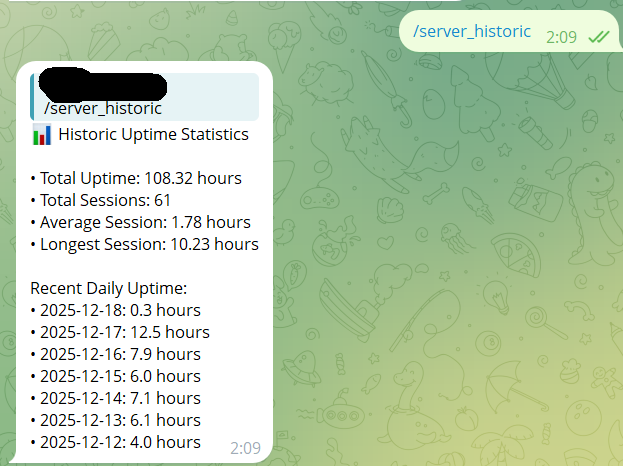
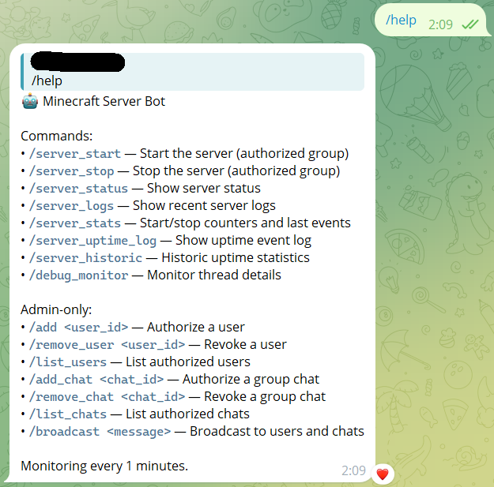

# Minecraft Telegram Bot (Docker server, Vanilla/Modded/Modpack)

[](https://github.com/asanzra/telegram-minecraft-server-bot/actions)

[View CI runs](https://github.com/asanzra/telegram-minecraft-server-bot/actions) • [Workflow file](https://github.com/asanzra/telegram-minecraft-server-bot/blob/main/.github/workflows/ci.yml)

A friendly Telegram bot to start/stop and monitor a Docker Compose–based Minecraft server. Works with vanilla or modded servers and any Compose service name.

See the latest changes in [RELEASE_NOTES.md](RELEASE_NOTES.md).

## Features
- Start/stop server with manual commands
- Background monitor detects auto starts/stops and health changes
- Player-list/status via `rcon-cli` when available
- Uptime sessions and stats persisted to JSON
- Repair tool to reconstruct history from `server_uptime.log`

## Prerequisites
- A Docker Compose Minecraft server. Recommended:
  - itzg/docker-minecraft-server: https://github.com/itzg/docker-minecraft-server
  - Ensure the container includes `rcon-cli` (the itzg image does)
- A Telegram bot token from BotFather

## Quick Start
1. Create a virtualenv and install deps:
   ```bash
   make install
   ```
2. Configure environment:
   - Copy `.env.example` to `.env` and fill values
   - Required: `TELEGRAM_TOKEN`, `ADMIN_ID`, `COMPOSE_DIR`
   - Optional: `RCON_SERVICE` (Compose service name providing `rcon-cli`)
3. Run the bot:
   ```bash
   make
   ```

## Screenshots











## Configuration
- `.env` keys:
  - `TELEGRAM_TOKEN`: BotFather token
  - `ADMIN_ID`: Your Telegram user id (integer). Use `/add` to manage other users later.
  - `COMPOSE_DIR`: Path to your Docker Compose project (directory containing `docker-compose.yml`).
  - `RCON_SERVICE` (optional): Compose service name that provides `rcon-cli` (defaults to first service detected). Example: `mc`.
  - `MONITOR_INTERVAL` (seconds), `START_TIMEOUT` (seconds), `HEALTH_GRACE_SECONDS` (seconds)

Note on service name detection:
- To find your Compose service name (for `RCON_SERVICE`), run:
  ```bash
  docker compose ps --format json | jq -r '.[].Service'
  ```
  If `jq` is not installed, inspect raw JSON and pick the `Service` value:
  ```bash
  docker compose ps --format json
  ```
  Set `RCON_SERVICE` to that service name (often `mc`).

Environment is `.env`-only. See `.env.example` for all supported variables.

## Commands
- `/server_start`: Start the server (authorized group chats)
- `/server_stop`: Stop the server (authorized group chats)
- `/server_status`: Current status + online players when available
Note on start confirmation:
- The bot sends the "started successfully" confirmation only when the server is actually ready for players (same criteria as `/server_status` reporting "running"). This avoids premature confirmations when the container is merely up but not yet joinable.
- `/server_logs`: Tail recent Compose logs
- `/server_stats`: Start/stop counters and last events
- `/server_uptime_log`: Uptime event log
- `/server_historic`: Historic uptime summary
- `/debug_monitor`: Monitor thread details

Admin-only:
- `/add <user_id>`: Authorize a user (also works by replying to a user message)
- `/remove_user <user_id>`: Revoke a user
- `/list_users`: List authorized users
- `/add_chat <chat_id>`: Authorize a group chat (or reply in a group)
- `/remove_chat <chat_id>`: Revoke a group chat
- `/list_chats`: List authorized chats
- `/broadcast <message>`: Broadcast to all users/chats
- `/shutdown_bot`: Stop the bot

### Roles and IDs
- **Admin**: The `ADMIN_ID` specified in `.env`. Can run all admin commands.
- **Authorized Users**: Can use bot commands in DMs and authorized group chats.
- **Authorized Group Chats**: Only these group chats can run start/stop commands.
  - Chat IDs are negative numbers (e.g., `-1001234567890`). Add via `/add_chat`.

### BotFather
- Create a bot with BotFather and copy the token into `TELEGRAM_TOKEN`.
- To find your numeric user ID: start the bot, try an admin command, and note the reported ID.

## Repair History
Rebuild `server_sessions.json` and `server_stats.json` from `server_uptime.log`:
```bash
make repair
```
The script prints a summary and anomaly counts.

## Files Created at Runtime
- `server_uptime.log`: Event log
- `server_sessions.json`: Session list (start, end, duration)
- `server_stats.json`: Aggregated counters and last events
- `data/users.json`, `data/chats.json`: Authorized identities
- `*.bak` backups are created on updates for safety

Note: These files and the `data/` directory are created automatically when you run the bot. If they are missing, the bot will generate them as needed; no manual setup is required.

## Project Structure (including mentioned files created at runtime)
- `bot.py`: Telegram bot entry point (concise)
- `minecraft.py`: Server manager (start/stop/monitor, stats and sessions)
- `access.py`: Persistence and broadcast for users/chats under `data/`
- `scripts/repair_history.py`: Rebuild sessions/stats from `server_uptime.log`
- `Makefile`: `venv`, `install`, `all`, `style`, and `repair` targets
- `requirements.txt`: Runtime dependencies
- `requirements-dev.txt`: Dev tooling (e.g., `ruff`)
- `.env.example`: Example configuration; copy to `.env`
- `RELEASE_NOTES.md`: Version highlights (e.g., v1.0.0)
- `.github/workflows/ci.yml`: CI to run install and lint on pushes/PRs
- `screenshots/`: repository images used in README
  - `start.png`
  - `server_start_status_stop.png`
  - `server_uptime_log.png`
  - `server_historic.png`
  - `help.png`
- `server_uptime.log`, `server_sessions.json`, `server_stats.json`: Runtime history
- `data/`: runtime data (`users.json`, `chats.json`, backups)

## Annex: Repository Structure
- `.gitignore`: Ignore local-only files (e.g., `.env`, venv, `__pycache__`, runtime JSON/logs)
- `README.md`: This documentation and usage guide
- `LICENSE`: License text

## License
The code in this repository is licensed under the Apache License 2.0 (Apache-2.0). You may use, modify, and distribute the software for any purpose, including commercial use, provided you retain copyright and license notices and include a NOTICE file where applicable. The license includes a patent grant with termination if a contributor initiates patent litigation.

See `LICENSE` for the full text.
